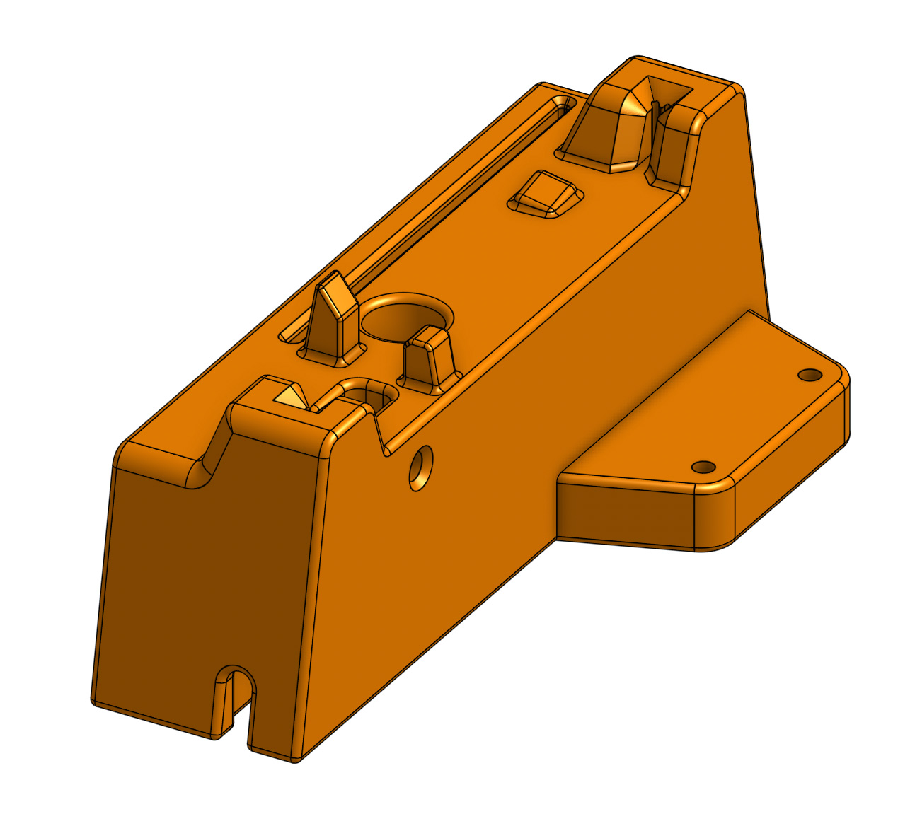

# Fin flashing jig

A stackable 3d printed jig for the Fin to simplify and accelerate the tedious process of connecting Fins for flashing.

  

- [Assembly guide](./documentation/assembly%20guide/assembly%20guide.md)
- [STL for printing](./output/STL)
