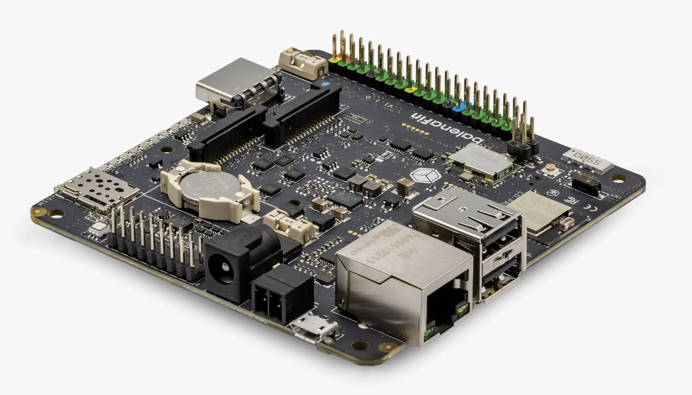
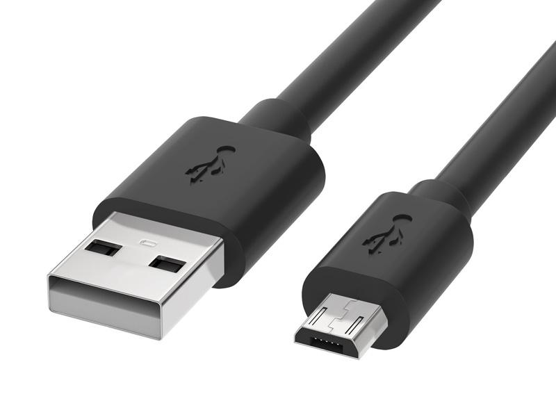
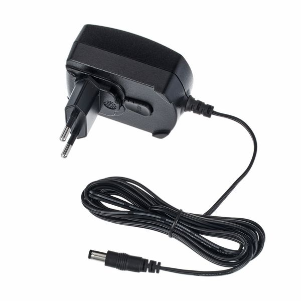
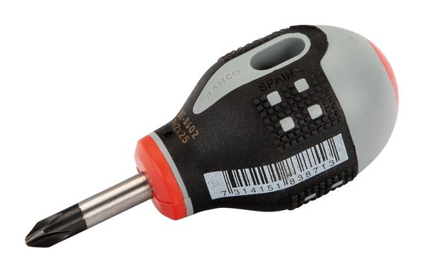
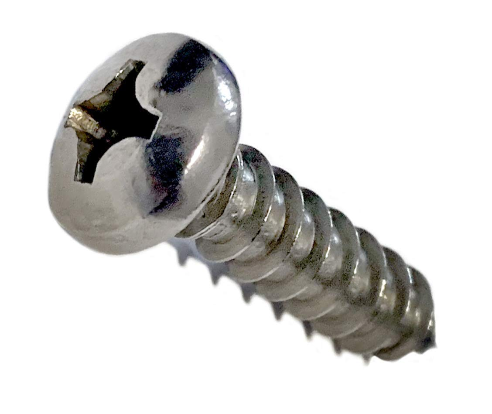

# Assembly guide
Fin Flashing Jig

## Contents

- [Chained flashing rigs](#Chained-flashing-rigs)
  - [Single flashing rig](#Single-flashing-rig)

## Single flashing rig

| Tools | Image |
|-|-|
| Hot glue gun |  |

| Parts | Qty | Image |
|-|-|-|
| [Flashing jig](../output/STL/flashingJig.stl) | 1 |  |
| balenaFin | 1 |  |
| micro USB cable | 1 |  |
| balenaFin DC 2.1/5.5 power supply | 1 |  |
| Fast curing adhesive | 1 |  |
| Hot glue sticks | 1 |  |

#### Steps

1. Print the jig using a 3d printer
  - For FDM printing use 0.2mm layer height, 25% infill, and ideally support

2. Guide the micro USB and DC cable through the relevant holes and connect them to a Fin

3. Push the Fin towards the jig so the PCB slots in the rails. The two cable connectors should also slide into the jig.
  - Press the cable connectors from the other side to make sure they are properly connected
  - When everything is in place, there should be no gap between the Fin PCB and the jig
  - You can use a rubber band to keep the Fin attached to the jig

4. Put a few drops of glue in hole that is adjacent to the micro USB cable to secure the cable in place
  - This step requires a fast curing adhesive or use of some sort of an adhesive accelerator
  - Hold the jig in a way that the hole is perpendicular to the ground with a small tilt, so excess glue drops away from the Fin

5. Secure both connectors using a decent amount of hot glue
  - Keep the jig upside down for several minutes until the hot glue cools down

6. If you use the jig stand alone you can bent and secure the cables using hot glue

## Chained flashing rigs

| Tools | Image |
|-|-|
| Phillips Screwdriver |  |

| Parts | Qty | Image |
|-|-|-|
| Single flashing jigs | - |  |
| 3x10mm pan head self threading screws | 2 per jig |  |

1. Prepare the desired amount of jigs following the previews [step](#Single-flashing rig)

2. Stack two jigs together and fasten the screws to secure them
